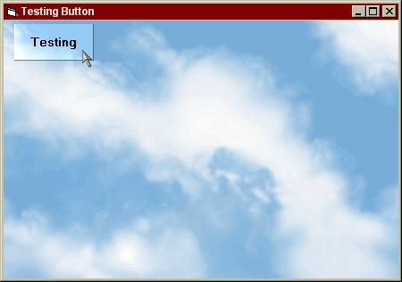



## Special Button

### Description

This button is cool for you that using graphics on form. If you move your mouse over the button, the button come with highlight picture base on form pictures. Click it, and the button move down still with the background.

This is looks like IE title bar with skin. For more information, you can email me: ddayandri@asuransi.astra.co.id
 
### More Info
 

             |
---                |---
**Submitted On**   |2000-03-30 11:38:24
**By**             |[Derio](https://github.com/Planet-Source-Code/PSCIndex/blob/master/ByAuthor/derio.md)
**Level**          |Intermediate
**User Rating**    |5.0 (15 globes from 3 users)
**Compatibility**  |VB 5\.0, VB 6\.0
**Category**       |[Custom Controls/ Forms/  Menus](https://github.com/Planet-Source-Code/PSCIndex/blob/master/ByCategory/custom-controls-forms-menus__1-4.md)
**World**          |[Visual Basic](https://github.com/Planet-Source-Code/PSCIndex/blob/master/ByWorld/visual-basic.md)
**Archive File**   |[CODE\_UPLOAD43983302000\.zip](https://github.com/Planet-Source-Code/derio-special-button__1-6890/archive/master.zip)

